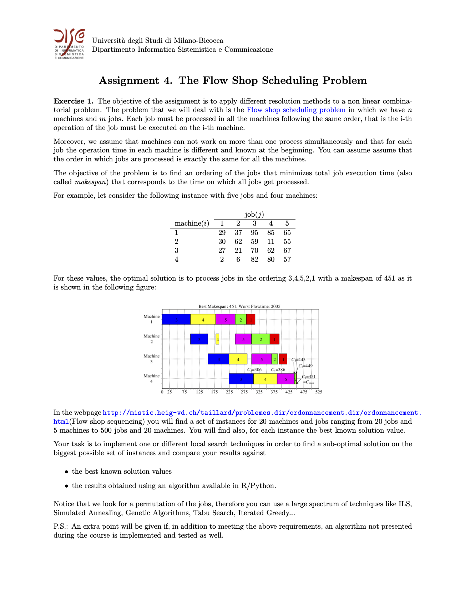

 
 

# Flowshop-Scheduling-Problem
Proposing a series of metaheuristics to solve a simple flowshop scheduling problem. This assignment was developed as part of the overall assessment of a Decision Models course.

For any doubt and/or perplexity, do not hesitate to contact:
- Lorenzo Pastore - l.pastore6@campus.unimib.it
