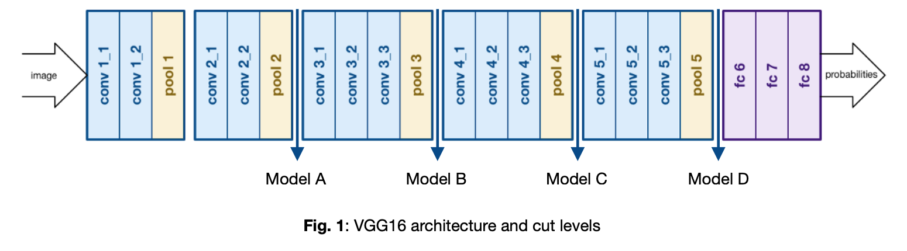

# Transfer-Learning-on-STL10-using-IMAGENET

The purpose of this assignment is to solve a classification problem on the dataset STL-10 through transfer learning using a convolutional network pre-trained on IMAGENET with a VGG16 architecture.

VGG16 is a model of convolutional neural network proposed by K. Simonyan and A. Zisserman of Oxford University in the paper "Very Deep Convolutional Networks for Large-Scale Image Recognition".

A NN, called "base_model", was loaded by esculding the highest classification level and specifying the input dimensions for our data. The NN was finally frozen so that it could be used as an extractor feature at different levels. Below is an image describing the network architecture and the different levels at which the features have been extracted.

